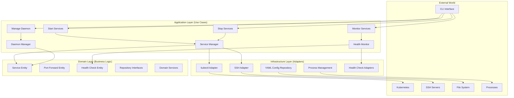
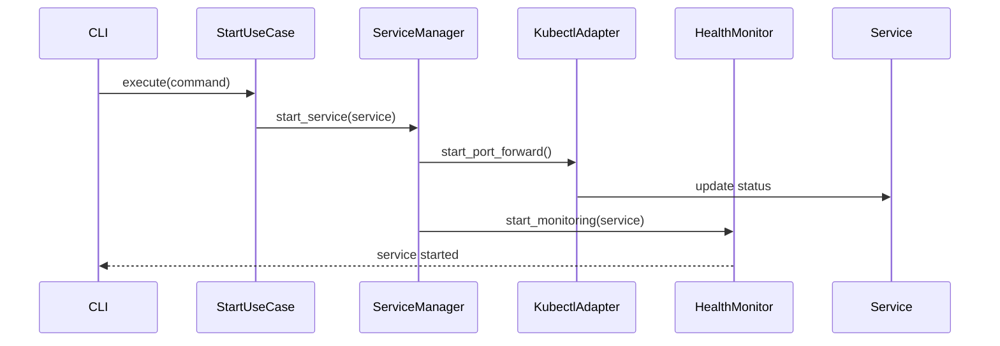
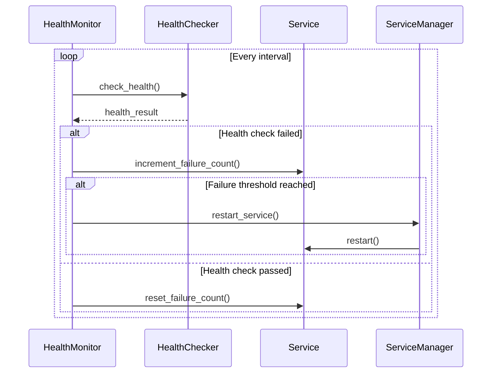
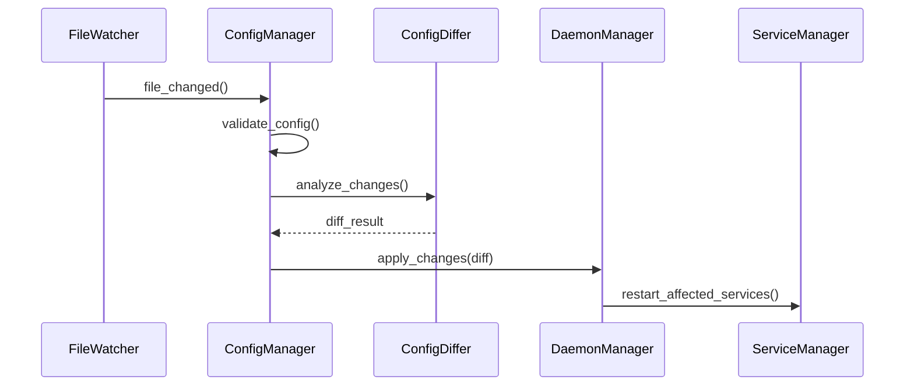
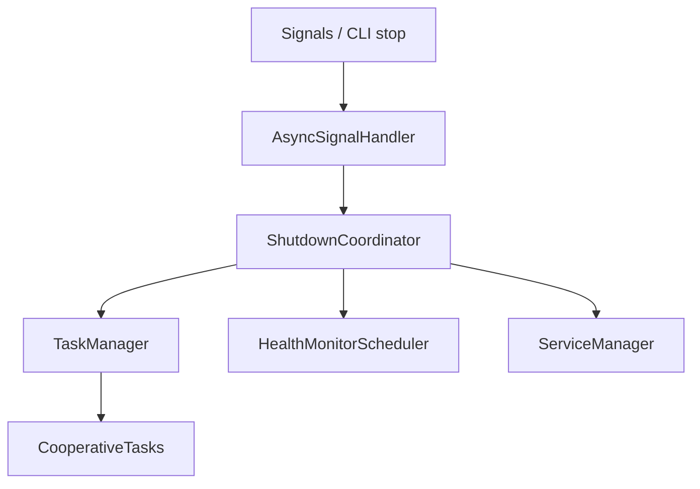

# LocalPort Architecture

This document describes LocalPort's system design to help developers understand
and extend it.

## Overview

LocalPort uses **Hexagonal Architecture** (Ports and Adapters). Business logic
is isolated from external systems, so the core is testable and the edges are
swappable.

## Hexagonal Architecture



## Layer Responsibilities

### 1. Domain Layer

Pure business logic, no external dependencies (`src/localport/domain/`).

- **Entities** (`domain/entities/`): `service`, `port_forward`, `health_check`,
  and the cluster health model (`cluster_info`, `cluster_health`,
  `cluster_event`, `resource_status`).
- **Value Objects** (`domain/value_objects/`): `port`, `connection_info`,
  `discovery`.
- **Enums** (`domain/enums.py`): `ServiceStatus`, `ForwardingTechnology`.
- **Repository interfaces** (`domain/repositories/`): `ServiceRepository`,
  `ConfigRepository`, `DiscoveryRepository`.
- **Domain services** (`domain/services/`): cross-entity rules and the cluster
  health provider.

### 2. Application Layer

Orchestrates domain objects into use cases (`src/localport/application/`).

- **Use cases**: start services, stop services, monitor services, manage daemon.
- **Application services**: `ServiceManager` (lifecycle/coordination),
  `HealthMonitor` (checking and restart logic), `DaemonManager` (background
  daemon), configuration management.
- **DTOs**: data structures passed between layers.

### 3. Infrastructure Layer

Implements inner-layer interfaces and talks to external systems
(`src/localport/infrastructure/`).

- **Port forwarding adapters** (`adapters/`): `KubectlAdapter`, `SSHAdapter`,
  `KubernetesDiscoveryAdapter`, and `AdapterFactory`.
- **Health check adapters** (`health_checks/`): `TCPHealthCheck`,
  `HTTPHealthCheck`, plus optional `KafkaHealthCheck` and
  `PostgreSQLHealthCheck` (loaded only if their extras are installed), created
  by `HealthCheckFactory`.
- **Repository implementations** (`repositories/`): `MemoryServiceRepository`,
  `YamlConfigRepository`.

### 4. CLI Layer

Command-line interface built on Typer and Rich (`src/localport/cli/`).

- **Commands** (`cli/commands/`): service (`start`, `stop`, `status`, `logs`),
  `daemon` (`start`, `stop`, `restart`, `status`, `reload`), `config`
  (`export`, `validate`, `add`, `remove`, `list`), `ssh` (`test`, `validate`),
  `cluster` (`status`).
- **Output formatting** (`cli/formatters/`): `output_format` defines the
  `OutputFormat` enum; `format_router` routes to the right renderer;
  `json_formatter` produces machine-readable output; `connection_formatter`
  renders connection details.

## Repositories

LocalPort abstracts data access behind repository interfaces in the domain
layer; the infrastructure layer provides concrete implementations.

### Interfaces

`ServiceRepository` (`domain/repositories/service_repository.py`) — all methods
async:

```python
class ServiceRepository(ABC):
    async def save(self, service: Service) -> None: ...
    async def find_by_id(self, service_id: UUID) -> Service | None: ...
    async def find_by_name(self, name: str) -> Service | None: ...
    async def find_all(self) -> list[Service]: ...
    async def find_by_tags(self, tags: list[str]) -> list[Service]: ...
    async def find_enabled(self) -> list[Service]: ...
    async def delete(self, service_id: UUID) -> bool: ...
    async def exists(self, service_id: UUID) -> bool: ...
    async def count(self) -> int: ...
```

`ConfigRepository` (`domain/repositories/config_repository.py`) loads and
manages YAML configuration. Key methods:

```python
class ConfigRepository(ABC):
    async def load_configuration(self, config_path: Path | None = None) -> dict[str, Any]: ...
    async def load_services(self, config_path: Path | None = None) -> list[Service]: ...
    async def validate_configuration(self, config: dict[str, Any]) -> bool: ...
    async def get_default_config_paths(self) -> list[Path]: ...
    async def substitute_environment_variables(self, config: dict[str, Any]) -> dict[str, Any]: ...
    # plus service-config CRUD: add/remove/update/get_service_config,
    # get_service_names, service_exists, backup_configuration, ...
```

### Implementations

- **`MemoryServiceRepository`** — in-memory `ServiceRepository`. Fast,
  asyncio-safe, no persistence across restart. Holds the daemon's live service
  state.
- **`YamlConfigRepository`** — file-based `ConfigRepository`. Human-readable
  YAML, environment-variable substitution, configuration validation.

### Dependency Injection and Contract Testing

Repositories are injected into use cases and services via their constructors,
so the domain and application layers depend only on the interfaces:

```python
class StartServicesUseCase:
    def __init__(self, service_repository: ServiceRepository):
        self._service_repository = service_repository
```

`ServiceRepositoryContractTest` and `ConfigRepositoryContractTest`
(`tests/unit/domain/test_repository_contracts.py`) define the behavior every
implementation must satisfy. A new implementation subclasses the relevant
contract test and supplies its instance via a `repository` fixture.

## Component Interactions

### Service Startup Flow



### Health Monitoring Flow



### Configuration Hot Reload Flow



## Design Patterns

- **Repository** — abstracts data access behind the interfaces above.
- **Factory** — `AdapterFactory` and `HealthCheckFactory` create concrete
  adapters/checkers keyed by type, and support runtime registration.
- **Strategy** — health checkers are interchangeable behind the `HealthChecker`
  interface; the scheduler calls them polymorphically.
- **Command** — CLI requests are modeled as command dataclasses (e.g.
  `StartServicesCommand`) passed to use cases.

## Technology Stack

**Core:** Python 3.11+, Typer (CLI), Rich (output), Pydantic (validation),
PyYAML, `structlog`, `psutil`, `watchdog`, asyncio.

**Optional extras:** `kafka-python` (Kafka health checks), `psycopg`
(PostgreSQL health checks). `aiohttp` ships as a core dependency for HTTP
health checks.

**Development:** `pytest` (+ `pytest-asyncio`, `pytest-cov`, `pytest-mock`,
`pytest-xdist`), `black`, `ruff`, `mypy`, `pre-commit`. `ruff` and `black` are
the enforced CI gates; `mypy` is strict but local-only (see
[CONTRIBUTING.md](../CONTRIBUTING.md#quality-gates)).

## Extension Points

### Add a port forwarding adapter

1. Implement `PortForwardingAdapter`
   (`infrastructure/adapters/base_adapter.py`): `start_port_forward`,
   `stop_port_forward`, `is_port_forward_running`, `validate_connection_info`,
   `get_adapter_name`, `get_required_tools`.
2. Add the technology to `ForwardingTechnology` in `domain/enums.py`.
3. Register it:

```python
factory.register_adapter("newtech", NewTechAdapter)
```

### Add a health check

1. Implement `HealthChecker`
   (`infrastructure/health_checks/base_health_checker.py`):

```python
class NewHealthCheck(HealthChecker):
    async def check_health(self, config: dict[str, Any]) -> HealthCheckResult: ...
    def validate_config(self, config: dict[str, Any]) -> bool: ...
    def get_default_config(self) -> dict[str, Any]: ...
```

2. Register it with the factory:

```python
factory.register_health_checker("newtype", NewHealthCheck)
```

Checkers with heavy or optional dependencies are registered lazily in
`HealthCheckFactory._register_optional_health_checkers()` so a missing extra
degrades gracefully instead of failing import.

### Add a CLI command

Write the command function in `cli/commands/`, then register it in
`cli/app.py` — either on the top-level app or a sub-`Typer`:

```python
app.command(name="new")(new_command)
# or, for a command group:
app.add_typer(group_app, name="group")
```

### Add an output formatter

Add the format to the `OutputFormat` enum
(`cli/formatters/output_format.py`) and handle it in `FormatRouter`
(`cli/formatters/format_router.py`).

## Error Handling

- **Domain**: raises domain-specific exceptions for business-rule violations.
- **Application**: catches and translates domain exceptions, adds use-case
  context.
- **Infrastructure**: handles external failures, retries, and logs technical
  detail.
- **CLI**: presents user-friendly messages and actionable guidance.

## Logging and Observability

LocalPort uses `structlog` with consistent structured fields:

```python
logger.info("Service started",
            service_name=service.name,
            local_port=service.local_port,
            technology=service.technology.value,
            process_id=process_id)
```

Log levels follow the standard DEBUG/INFO/WARN/ERROR scheme. The daemon tracks
service health status and restart counts and audits configuration changes.

## Security Considerations

- No credentials in plain text; environment-variable substitution for secrets;
  secure SSH key-file handling.
- Port forwards run in isolated processes with proper cleanup on termination.
- All external input validated via Pydantic and configuration-schema
  enforcement.
- Local-only port binding by default, with configurable bind addresses and
  connection timeouts.

## Performance Considerations

- Non-blocking asyncio I/O for all network operations; concurrent health checks
  and parallel start/shutdown.
- Efficient process management and memory-conscious data structures.
- Configuration caching and efficient file watching for hot reload.

## Testing Strategy

Unit tests cover domain and application logic in isolation; integration and
e2e tests exercise adapters and full workflows; contract tests enforce
repository-interface compliance. See
[CONTRIBUTING.md](../CONTRIBUTING.md#testing) for layout, markers, and how to
run the suite.

## Shutdown Infrastructure

The daemon uses a coordinated, multi-phase graceful shutdown to eliminate race
conditions and cleanly stop background work (this resolved Mac service
stability issues).

Signals (`SIGTERM`, `SIGINT`, and reload/status signals) and the CLI stop
command feed an `AsyncSignalHandler`, which deduplicates them and hands off to a
`ShutdownCoordinator`. The coordinator drives a `TaskManager` that owns the
`CooperativeTask` instances (e.g. per-service health monitors), giving each a
chance to finish or cancel cleanly before force cleanup.



Shutdown proceeds through four bounded phases; if a phase times out, the
coordinator advances to the next one so shutdown always terminates:

| Phase | Timeout | Purpose |
|-------|---------|---------|
| Stop New Work | 2s | Stop accepting new tasks, monitoring, and service starts |
| Complete Current | 8s | Let in-flight operations and health checks finish |
| Cancel Tasks | 15s | Cooperatively cancel remaining tasks |
| Force Cleanup | 5s | Force-terminate tasks and emergency-stop services |

Total shutdown is bounded to under 30 seconds and typically completes in a few
seconds.

## Future Considerations

Possible future directions include a plugin system for adapters, health checks,
and formatters; distributed multi-node daemon coordination; and a
programmatic API. These are aspirational and not yet implemented.
